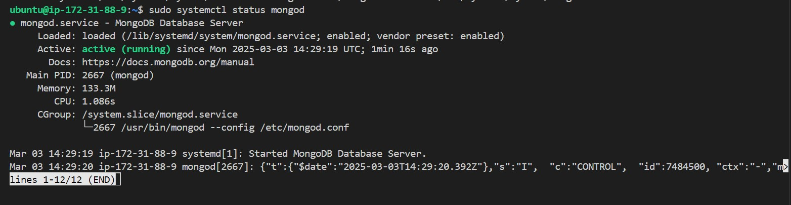
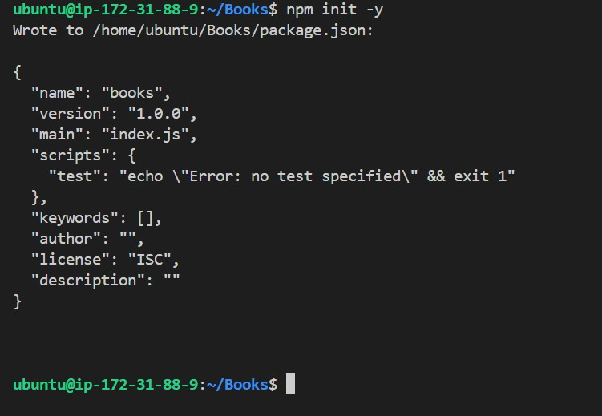

# MEAN-STACK-IMPLEMENTATION
MEAN Stack Deployment on Ubuntu 22.04 (AWS) This documentation explains how to deploy a MEAN (MongoDB, Express, AngularJS, Node.js) stack application on an Ubuntu 22.04 AWS EC2 instance. Each step includes the commands to execute and the rationale behind it.

## Table of Contents

1. ### Prerequisites
2. ### Step 1: Update Ubuntu and Install Node.js 20
3. ### Step 2: Install MongoDB Community Edition 6.0
4. ### Step 3: Set Up the MEAN Application
5. ### Create the Project Directory
6. ### Server Setup with Node.js and Express
7. ### Configure Routes and Database Models
8. ### Step 4: Build the Front-End with AngularJS
9. ### Step 5: Running and Testing the Application
10. ### Troubleshooting

## Prerequisites

- AWS Account & EC2 Instance:
You need an AWS account and an EC2 instance running Ubuntu 22.04 LTS.
Reason: Ubuntu 22.04 is a supported LTS release that provides stability and security updates.

- Security Group Configuration:
Ensure that the EC2 instance’s security group allows inbound traffic on port 3300 (or your chosen port) so that your application is accessible externally.

- SSH/Terminal Access:
Use SSH or AWS CloudShell to connect to your instance.

## Step 1: Update Ubuntu and Install Node.js 20

### 1.1 Update and Upgrade the System

`sudo apt update`

`sudo apt upgrade -y`

This will ensure that your system has the latest security patches and software versions.

### 1.2 Install Required Prerequisites for HTTPS Repositories
Install packages needed for adding new repositories over HTTPS using the command below:

`sudo apt -y install curl dirmngr apt-transport-https lsb-release ca-certificates`

These packages help securely download and verify external packages.

### 1.3 Install Node.js 20 from NodeSource
Download the Node.js 20 setup script and install it using the commands below:

`curl -fsSL https://deb.nodesource.com/setup_20.x | sudo -E bash -`

`sudo apt install -y nodejs`

Node.js is required to run our server-side JavaScript code. Using Node.js 20 ensures compatibility with the latest features and improvements.

### 1.4 Verify Node.js Installation
Check the versions to confirm the installation:

`node -v`
`npm -v`

It confirms that the correct versions are installed and ready to use.

## Step 2: Install MongoDB Community Edition 6.0

### 2.1 Import MongoDB GPG Key and Set Up Repository

First, import the MongoDB GPG key for package verification using the command below:

`wget -qO - https://www.mongodb.org/static/pgp/server-6.0.asc | sudo gpg --dearmor -o /usr/share/keyrings/mongodb-org-6.0.gpg`

The GPG key ensures that the MongoDB packages are authentic and not tampered with.

create the repository file with this command

`echo "deb [ arch=amd64,arm64 signed-by=/usr/share/keyrings/mongodb-org-6.0.gpg ] https://repo.mongodb.org/apt/ubuntu jammy/mongodb-org/6.0 multiverse" | sudo tee /etc/apt/sources.list.d/mongodb-org-6.0.list`

This tells Ubuntu where to fetch MongoDB packages specific to Ubuntu 22.04 (Jammy).

### 2.2 Update and Install MongoDB

Update package lists and install MongoDB:

`sudo apt update`

`sudo apt install -y mongodb-org`

Installing MongoDB Community Edition provides the document database for our MEAN stack.

### 2.3 Start and Enable MongoDB
Try starting MongoDB using systemd:

`sudo systemctl daemon-reload`

`sudo systemctl start mongod`

Check its status

`sudo systemctl status mongod`



Starting the MongoDB service allows our application to connect to the database. If the service file is missing, refer to troubleshooting later.

## Step 3: Set Up the MEAN Application

### Create the Project Directory

1. Create a directory for the project and initialize npm. Call the name of the directory Books and open the directory using the commands below:

`mkdir Books && cd Books`

`npm init -y`



This directory will contain all your project files. Running npm init -y generates a default package.json file which manages project dependencies.


2. Install Required Node Packages:

`sudo npm install express`

`sudo npm mongoose body-parser`

- Express: A web framework for handling HTTP requests.
- Mongoose: Simplifies MongoDB interactions with schema-based models.
- body-parser: Parses incoming request bodies in middleware.


### Server Setup with Node.js and Express

Create a file named server.js in the Books directory:
`touch server.js` 

open the file with 

`nano server.js`

paste the command below into the file

```
// server.js
const express = require('express');
const bodyParser = require('body-parser');
const app = express();

// Serve static files from the public folder
app.use(express.static(__dirname + '/public'));

// Parse JSON request bodies
app.use(bodyParser.json());

// Import routes from the apps folder
require('./apps/routes')(app);

// Set the port for the application
app.set('port', 3300);

// Start the server and listen on the specified port
app.listen(app.get('port'), () => {
    console.log('Server up: http://localhost:' + app.get('port'));
});

```

This file initializes the Express server, sets up middleware for static files and JSON parsing, and imports the route definitions.


