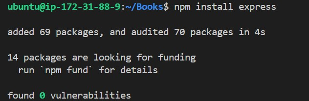

# MEAN-STACK-IMPLEMENTATION
MEAN Stack Deployment on Ubuntu 22.04 (AWS) This documentation explains how to deploy a MEAN (MongoDB, Express, AngularJS, Node.js) stack application on an Ubuntu 22.04 AWS EC2 instance. Each step includes the commands to execute and the rationale behind it.

## Table of Contents

1. ### Prerequisites
2. ### Step 1: Update Ubuntu and Install Node.js 20
3. ### Step 2: Install MongoDB Community Edition 6.0
4. ### Step 3: Set Up the MEAN Application
5. ### Create the Project Directory
6. ### Server Setup with Node.js and Express
7. ### Configure Routes and Database Models
8. ### Step 4: Build the Front-End with AngularJS
9. ### Step 5: Running and Testing the Application
10. ### Troubleshooting

## Prerequisites

- AWS Account & EC2 Instance:
You need an AWS account and an EC2 instance running Ubuntu 22.04 LTS.
Reason: Ubuntu 22.04 is a supported LTS release that provides stability and security updates.

- Security Group Configuration:
Ensure that the EC2 instance’s security group allows inbound traffic on port 3300 (or your chosen port) so that your application is accessible externally.

- SSH/Terminal Access:
Use SSH or AWS CloudShell to connect to your instance.

## Step 1: Update Ubuntu and Install Node.js 20

### 1.1 Update and Upgrade the System

`sudo apt update`

`sudo apt upgrade -y`

This will ensure that your system has the latest security patches and software versions.

### 1.2 Install Required Prerequisites for HTTPS Repositories
Install packages needed for adding new repositories over HTTPS using the command below:

`sudo apt -y install curl dirmngr apt-transport-https lsb-release ca-certificates`

These packages help securely download and verify external packages.

### 1.3 Install Node.js 20 from NodeSource
Download the Node.js 20 setup script and install it using the commands below:

`curl -fsSL https://deb.nodesource.com/setup_20.x | sudo -E bash -`

`sudo apt install -y nodejs`

Node.js is required to run our server-side JavaScript code. Using Node.js 20 ensures compatibility with the latest features and improvements.

### 1.4 Verify Node.js Installation
Check the versions to confirm the installation:

`node -v`
`npm -v`

It confirms that the correct versions are installed and ready to use.

## Step 2: Install MongoDB Community Edition 6.0

### 2.1 Import MongoDB GPG Key and Set Up Repository

First, import the MongoDB GPG key for package verification using the command below:

`wget -qO - https://www.mongodb.org/static/pgp/server-6.0.asc | sudo gpg --dearmor -o /usr/share/keyrings/mongodb-org-6.0.gpg`


The GPG key ensures that the MongoDB packages are authentic and not tampered with.

create the repository file with this command

`echo "deb [ arch=amd64,arm64 signed-by=/usr/share/keyrings/mongodb-org-6.0.gpg ] https://repo.mongodb.org/apt/ubuntu jammy/mongodb-org/6.0 multiverse" | sudo tee /etc/apt/sources.list.d/mongodb-org-6.0.list`


This tells Ubuntu where to fetch MongoDB packages specific to Ubuntu 22.04 (Jammy).

### 2.2 Update and Install MongoDB

Update package lists and install MongoDB:

`sudo apt update`

`sudo apt install -y mongodb-org`


Installing MongoDB Community Edition provides the document database for our MEAN stack.

### 2.3 Start and Enable MongoDB
Try starting MongoDB using systemd:

`sudo systemctl daemon-reload`

`sudo systemctl start mongod`

Check its status

`sudo systemctl status mongod`


Starting the MongoDB service allows our application to connect to the database. If the service file is missing, refer to troubleshooting later.

## Step 3: Set Up the MEAN Application

### Create the Project Directory

1. Create a directory for the project and initialize npm. Call the name of the directory Books and open the directory using the commands below:

`mkdir Books && cd Books`

`npm init -y`


This directory will contain all your project files. Running npm init -y generates a default package.json file which manages project dependencies.


2. Install Required Node Packages:

`sudo npm install express`



`sudo npm mongoose body-parser`


- Express: A web framework for handling HTTP requests.
- Mongoose: Simplifies MongoDB interactions with schema-based models.
- body-parser: Parses incoming request bodies in middleware.


### Server Setup with Node.js and Express

Create a file named server.js in the Books directory:
`touch server.js` 

open the file with 

`nano server.js`

paste the command below into the file

```
// server.js
const express = require('express');
const bodyParser = require('body-parser');
const app = express();

// Serve static files from the public folder
app.use(express.static(__dirname + '/public'));

// Parse JSON request bodies
app.use(bodyParser.json());

// Import routes from the apps folder
require('./apps/routes')(app);

// Set the port for the application
app.set('port', 3300);

// Start the server and listen on the specified port
app.listen(app.get('port'), () => {
    console.log('Server up: http://localhost:' + app.get('port'));
});

```

This file initializes the Express server, sets up middleware for static files and JSON parsing, and imports the route definitions.


## Configure Routes and Database Models

### 3.1 Set Up Express Routes
1. Create the apps folder, open it and create a routes file inside it. Use the following commands

`mkdir apps && cd apps`

`touch routes.js`

2. Open the file 
`nano routes.js`

Add the following content to routes.js:

```
// routes.js
const Book = require('./models/book');
const path = require('path');

module.exports = function(app) {
  // GET route to fetch all books from MongoDB
  app.get('/book', (req, res) => {
    Book.find({}, (err, result) => {
      if (err) throw err;
      res.json(result);
    });
  });

  // POST route to add a new book record
  app.post('/book', (req, res) => {
    const book = new Book({
      name: req.body.name,
      isbn: req.body.isbn,
      author: req.body.author,
      pages: req.body.pages
    });
    book.save((err, result) => {
      if (err) throw err;
      res.json({
        message: "Successfully added book",
        book: result
      });
    });
  });

  // DELETE route to remove a book using its ISBN
  app.delete("/book/:isbn", (req, res) => {
    Book.findOneAndRemove({ isbn: req.params.isbn }, (err, result) => {
      if (err) throw err;
      res.json({
        message: "Successfully deleted the book",
        book: result
      });
    });
  });

  // Fallback route to serve the AngularJS application
  app.get('*', (req, res) => {
    res.sendFile(path.join(__dirname, '..', 'public', 'index.html'));
  });
};
```
- The GET route retrieves all book records from the database.
- The POST route adds a new book to the database.
-  The DELETE route removes a book by its ISBN.
- The fallback route ensures that any undefined route returns the main HTML page.


### 3.2 Configure the Mongoose Model

1. Create the Mongoose model file:
`mkdir models`

Navigate to the models folder: `cd models`

2. Create a book.js file this folder 
`nano book.js` and add the following content to the file

```
// book.js
const mongoose = require('mongoose');

// Connect to the local MongoDB instance using the 'test' database
const dbHost = 'mongodb://localhost:27017/test';
mongoose.connect(dbHost, { useNewUrlParser: true, useUnifiedTopology: true });
mongoose.set('debug', true);

// Define a schema for our book records
const bookSchema = mongoose.Schema({
  name: String,
  isbn: { type: String, index: true },
  author: String,
  pages: Number
});

// Create and export the Book model
module.exports = mongoose.model('Book', bookSchema);
```
- Mongoose is used here to define a schema and model for book documents.
- The schema ensures data consistency and provides a simple API for database operations.

## Step 4: Build the Front-End with AngularJS

Even though AngularJS is an older framework, it is used in this example to demonstrate dynamic interaction with the backend.

### 4.1 Create the Public Directory

Return to the root project folder (Books) and create a public directory:

`cd ../..`

`mkdir public && cd public`

### 4.2 Create the AngularJS Controller File (script.js)

Create a file named script.js:

`touch script.js`
 and paste the following code:

 ```
 // script.js
var app = angular.module('myApp', []);
app.controller('myCtrl', function($scope, $http) {
  // Fetch all books from the server and bind them to the scope
  $http({
    method: 'GET',
    url: '/book'
  }).then(function successCallback(response) {
    $scope.books = response.data;
  }, function errorCallback(response) {
    console.error('Error: ' + response);
  });

  // Delete a book using its ISBN
  $scope.del_book = function(book) {
    $http({
      method: 'DELETE',
      url: '/book/' + book.isbn
    }).then(function successCallback(response) {
      console.log(response);
      // Optionally refresh the list here
    }, function errorCallback(response) {
      console.error('Error: ' + response);
    });
  };

  // Add a new book to the database
  $scope.add_book = function() {
    const newBook = {
      name: $scope.Name,
      isbn: $scope.Isbn,
      author: $scope.Author,
      pages: $scope.Pages
    };
    $http({
      method: 'POST',
      url: '/book',
      data: newBook
    }).then(function successCallback(response) {
      console.log(response);
      // Optionally refresh the list here
    }, function errorCallback(response) {
      console.error('Error: ' + response);
    });
  };
});
```

- This file creates an AngularJS module and controller that handles CRUD operations by communicating with our Express backend.
- It uses AngularJS’s $http service to make GET, POST, and DELETE requests.

### 4.3 Create the HTML File (index.html)
Create an index.html file:
`index.html`

open the file `nano index.html` and paste the following codes:

```
<!doctype html>
<html ng-app="myApp" ng-controller="myCtrl">
  <head>
    <meta charset="utf-8">
    <title>Book Register</title>
    <!-- Include AngularJS from CDN -->
    <script src="https://ajax.googleapis.com/ajax/libs/angularjs/1.8.2/angular.min.js"></script>
    <script src="script.js"></script>
  </head>
  <body>
    <!-- Form to add a new book -->
    <div>
      <table>
        <tr>
          <td>Name:</td>
          <td><input type="text" ng-model="Name"></td>
        </tr>
        <tr>
          <td>ISBN:</td>
          <td><input type="text" ng-model="Isbn"></td>
        </tr>
        <tr>
          <td>Author:</td>
          <td><input type="text" ng-model="Author"></td>
        </tr>
        <tr>
          <td>Pages:</td>
          <td><input type="number" ng-model="Pages"></td>
        </tr>
      </table>
      <button ng-click="add_book()">Add</button>
    </div>
    <hr>
    <!-- Table displaying the list of books -->
    <div>
      <table border="1">
        <tr>
          <th>Name</th>
          <th>ISBN</th>
          <th>Author</th>
          <th>Pages</th>
          <th>Action</th>
        </tr>
        <tr ng-repeat="book in books">
          <td>{{book.name}}</td>
          <td>{{book.isbn}}</td>
          <td>{{book.author}}</td>
          <td>{{book.pages}}</td>
          <td>
            <button ng-click="del_book(book)">Delete</button>
          </td>
        </tr>
      </table>
    </div>
  </body>
</html>
```

- This HTML file is the front-end interface for your application.
- It includes the AngularJS library and your custom script, provides a form for data entry, and displays the list of books with the option to delete them.

## Step 5: Running and Testing the Application
5.1 Start the Server
Return to the project root (the Books folder):

`cd ../`

Run the server:

`node server.js`

Starting the server with Node.js allows your Express application to listen for incoming HTTP requests on port 3300.

### 5.2 Test Locally
Open a new terminal session and test the server with:
`curl -s http://localhost:3300`

This command verifies that the server is responding and serving the HTML page.

### 5.3 Access from the Internet
Using your instance’s Public IP or Public DNS, navigate to:

`http://<your-public-ip>:3300`

With the security group configured to allow port 3300, you can now access your application from any browser.


## Conclusion
This documentation provides a detailed, step-by-step guide to deploying a MEAN stack application on an Ubuntu 22.04 AWS EC2 instance. Each command and configuration file is explained to help you understand the purpose behind each step.

Happy coding, and feel free to contribute or ask questions if you need further clarification!